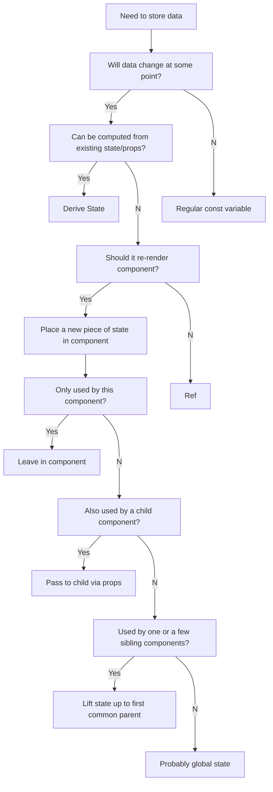

# Section 7: Thinking in React: State Management

## The "Thinking in React" Process

1. Break the desired UI into **components** and establish the **component tree**.
2. Build a **static** version of React (without state)
3. Think about **state**:

- When to use state
- Types of state: local vs. global
- Where to place each piece of state

4. Establish **data flow**:

- One-way data flow
- Child-to-parent communication
- Accessing global state

> Note:
> Steps 3 and 4 are known as **"state management"**

## State Management

Deciding **when** to create pieces of state, what **types** of state are necessary, **where** to place each piece of state, and how data **flows** through the app

## Types of State:

1. Local State

- State needed **only by one or few components**
- State that is defined in a component and **only that component and child components** have access to it (by passing via props)
- We should always start with local state

2. Global State

- State that **many components** might need
- **Shared** state that is accessible to **every component** in the entire application
- We can define global state by using React's _Context API_ or an external global state management library _Redux_

## State: When and Where



## Lifting Up State

- By **lifting state up**, we successfully shared one piece of state with multiple components in different positions in the component tree.
- **Child-to-parent communication** (inverse data flow): child updating parent state (data flowing "up") by putting a setter into the child.

## Deriving State

- **Derived State**: state that is computed from an existing piece of state or from props
- Derived states are calculated from another state, so just use regular variables, not _useState_
- The original state will be the **single source of truth** for this related data
- Works because re-rendering component will **automatically recalculate** derived state

## The Children Prop

```js
<Button onClick={previous}>
  <span>👈</span>Previous
</Button>
```

- In this example, the **children** of the button is:

```js
<span>👈</span>Previous
```

- Children prop is accessible through **props.children**
- The children prop allow us \*\*to pas JSX into an element (besides regular props)
- Essential tool to make **reusable** and **configurable** components (especially component **content**)
- Really useful for **generic** component that **don't know their content** before being used (e.g. modal)
